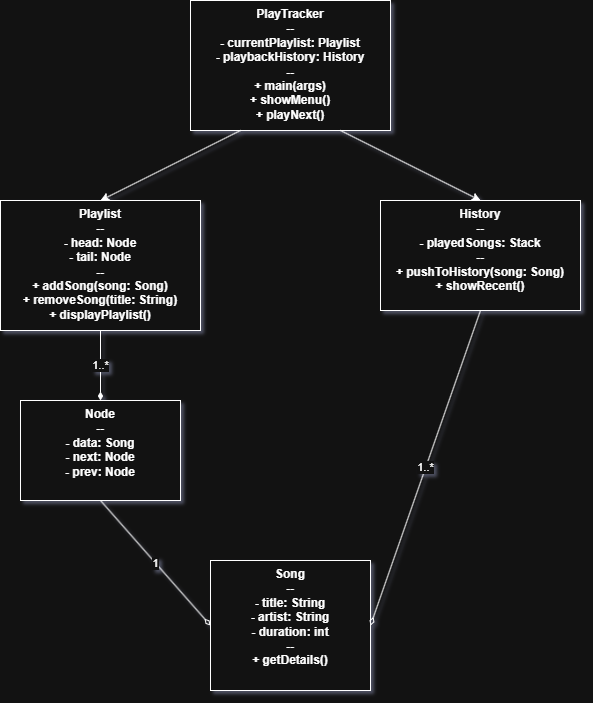

```text
                   //                 //////////                            //                 
                  //                      //                               //                  
                 //                      //                               //                   
 /////////      //   ///////  //   //   //   //////   ///////   /////    //  //   //////  //////
//     //      //          // //   //  //   //    //        // //       //  //  //    // //    //
//     //     //    ///////// //   // //   //        ///////// //      ///     ///////  //       
//     //    //    //     //  ////// //   //        //     // //      // //   //        //       
////////    //     ////////      // //   //         ////////   ///// //   //   //////  //        
//                            ///                                                            
//
```

**Integrantes:**
1.  **[Constantino Demostenes Bekios Canales]**
2.  **[Fernando Andres Lagos Barahona]**

## Descripción

playTracker es un reproductor de música por línea de comandos construido en C++. Su objetivo principal es demostrar el uso de estructuras de datos para gestionar colas de reproducción de manera dinámica. El programa permite a los usuarios:

*   Cargar una lista de canciones desde un archivo fuente.
*   Administrar una cola de reproducción con funciones básicas.
*   Navegar entre canciones (siguiente y anterior).
*   Visualizar la canción en curso y las pendientes en la cola.

## Diagrama de Clases



(Stack hecho manualmente sin librerias STL)

## Instrucciones de Compilación y Ejecución

⚙️ Instrucciones de Compilación y Ejecución
Prerrequisitos:

Compilador adecuado instalado en el sistema (ej. g++ para C++).

Terminal o consola de comandos.

**Pasos para Compilar:**
1.  Clona el repositorio: `git clone https://github.com/cruvksqio/Taller1EDD.git`
2.  Entra al directorio del proyecto: `cd Taller1EDD`
3.  Crea y entra a la carpeta de compilación: `mkdir build && cd build`
4.  Genera los archivos de construcción con CMake: `cmake ..`
5.  Compila el proyecto: `cmake --build .`

**Ejecución:**
Una vez compilado, ejecuta el binario generado desde la terminal: `./playTracker`

**Archivo de Origen de Música:**
El programa lee la lista de canciones inicial desde el archivo `music_source.txt` ubicado en la raíz del proyecto.

## Funcionamiento

La aplicación funciona recibiendo un archivo de texto con las canciones, que son almacenadas en un vector. Una vez cargadas, el usuario interactúa con un menú, basado en una lista circular doblemente enlazada, que ofrece las opciones de reproducir, pausar, avanzar, retroceder y ver la lista de espera.

Para empezar a usar el menú, simplemente ejecuta el programa y elige tu opción favorita escribiendo el número correspondiente. El flujo es guiado por completo desde la consola.
